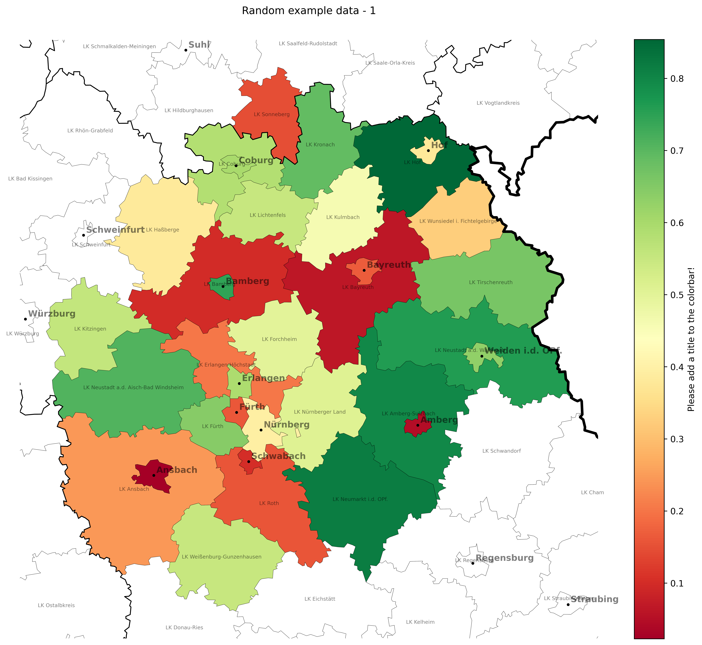
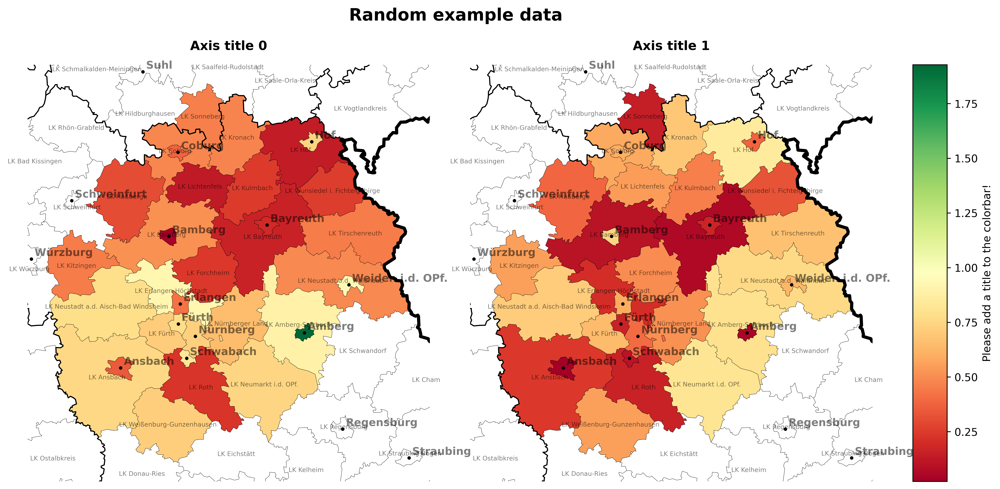
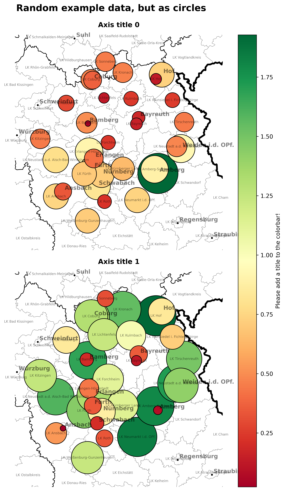

#### Installation

Since this project main requirement is the geopandas library
[geopandas](https://geopandas.org/en/stable/index.html). I requires several binaries that are more or less complicated to install using pip or even build from source.
Following the advice from [their installation page](https://geopandas.org/en/stable/getting_started/install.html) it is best installed using [Anaconda](https://www.anaconda.com/products/distribution).

To install all requirements best use the following command line in the Anaconda terminal:
```
conda install -c conda-forge regex geopandas
```
#### Description

This script can plot numeric data from a simple csv table into a map consisting of several layers of shape files.
Those shape files can be found in the geo_data folder.

It used the headers of the csv file and will look for a county in the
shape file 'geo_data/vg5000_01-01.gk3.shape.ebenen/vg5000_ebenen_0101/VG5000_KRS.shp' with a mathing name.
Afterwards it uses the data value to set the fill color of the county corresponding to a chosen colormap.

Each row in the data will be saved to a separate modified svg-file.

Arguments:

    -h
        Display this help message^^

    -f <datafile>, --filename <datafile>
        Default "ExampleData.csv". The filename of the data file that shall be plotted.
            If you want to specify the location using region names, use the following format:
                'Region 1', 'Region 2', 'Region 3'
                    0.2   ,    0.1    ,    0.3
                    0.3   ,    0.2    ,    0.5
            If you want labeled circles of 'value'-dependant size and color at specific coordinates:
                 'lat', 'lon' , 'value', 'label'
                49.294, 10.663,    1   ,  'P0'
                49.258, 10.664,    2   ,  'P1'
                50.380, 11.957,   3.2  ,  'P2'
            And if you want non labeled circles of 'value'-dependant color at specific coordinates:
                 'lat', 'lon' , 'value'
                49.294, 10.663, 'eins'
                49.258, 10.664, 'zwei'
                50.380, 11.957, 'drei'

    -a <yourtitle>, --title_axis <yourtitle>
        Default "Please add a title to the colorbar!". The title for the colorbar.

    -t <yourtitle>, --title <yourtitle>
        Optional. The title of the whole figure.

    --cmap <yourcmap>
        Default "RdYlGn". The matplotlib colormap of your choice.
        You can reverse a colormap, by adding a '_r' suffix to a cmap.

    --text_alpha <flaot>
        Default 0.5. The alpha value of text elements. 0 is invisible.

    --save_to <yourPath>
        Default 'output/{datafile}'. The folder and filename of the generated image files.

    --format <imageFormat>
        Default 'png'. The image file format of your choice. Recommended choices are 'png', 'svg' or 'pdf'.

    --crop' <yourChoice>
        Default "9.9136935, 12.7207591, 48.7730094, 50.6524235".
            If you pass True or 'data', the map will be cropped to fit the data in datafile.
            Alternatively you can pass a list of coordinates describing the geo-referenced bounding box in
            comma-separated decimal longitude and latitude values.
            The bounding box for the European Metropolitan Area Nuremberg (EMN) is "9.9136935, 12.7207591, 48.7730094, 50.6524235"
            If you pass False, the all data and shapefiles will be plotted (Not recommended!)

    --zoom <float>
        Default 1. A factor that scales all linewidth, textsizes and cicles. Can be used to finetune those to different map sizes.

    --data_viz <yourChoice>
        Default 'area'.
            If you pass 'area', the values from the datafile will be used to color the corresponding regions.
            If you pass 'circle', instead of coloring the regions a circles will be drawn at the center of the
            corresponding regions. Their size and color depends on the data.
            Automatically set to 'circle', if the data has a 'lat' and a 'lon' column.

    --label_counties
        Default True. Defines whether counties will be labeled or not.

    --add_roads
        Default False. Defines whether roads will be plotted or not.

    --use_cx
        Default False. Defines whether labels will be loaded from the provider Stamen using the contextly library.

### Examples

#### Simply plot the example data
```
python plot_geo_data.py
```
Two files will be produced:
- output/ExampleData_0.png
- output/ExampleData_1.png




#### Plot the example data, but in a single figure
```
python plot_geo_data.py -T "Random example data" -t "Axis title 0;Axis title 1" --n_cols 2 --label_counties
```
A single file will be produced:
- output/ExampleData.png



#### Plot the example data, but as circles
```
python plot_geo_data.py -T "Random example data, but as circles" -t "Axis title 0;Axis title 1" --data_viz circle --n_rows 2 --label_counties --save_to "output/ExampleData_circles"
```
A single file will be produced:
- output/ExampleData.png



#### Plot the example point data
```
python plot_geo_data.py -f "ExampleData_points_1.csv" -T "Random points" --add_roads -o "output/Random_points_1"
```
A single file will be produced:
- output/Random_points_1.png


#### Plot the example point data with values
```
python plot_geo_data.py -f "ExampleData_points_2.csv" -T "Random points" -a Value --add_roads -o "output/Random_points_2"
```
A single file will be produced:
- output/Random_points_2.png


#### Plot the example point data with category values
```
python plot_geo_data.py -f "ExampleData_points_3.csv" -T "Random category points" --add_roads -o "output/Random_points_3"
```
A single file will be produced:
- output/Random_points_3.png


#### Plot the example point data with category values and labels
```
python plot_geo_data.py -f "ExampleData_points_4.csv" -T "Random points with category values and labels" -a Categories --add_roads -o "output/Random_points_4"
```
A single file will be produced:
- output/Random_points_4.png


